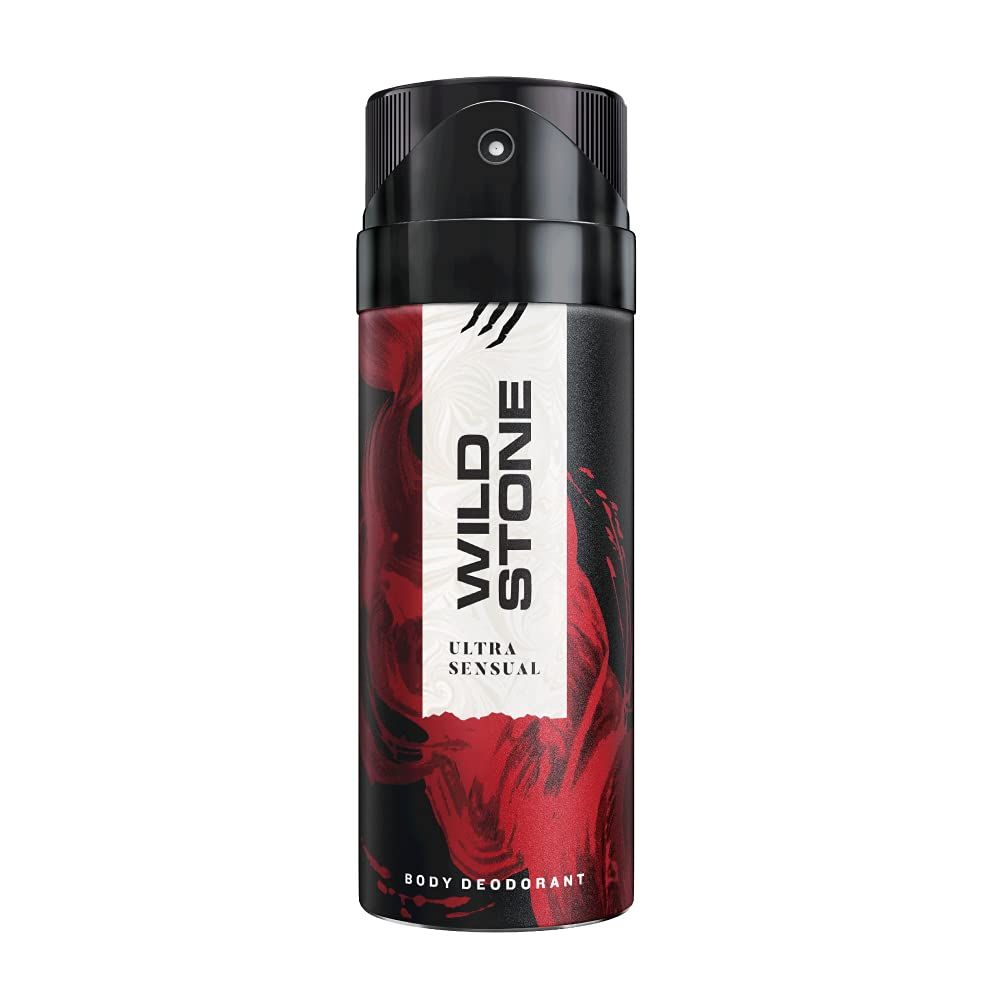
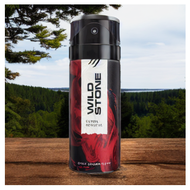
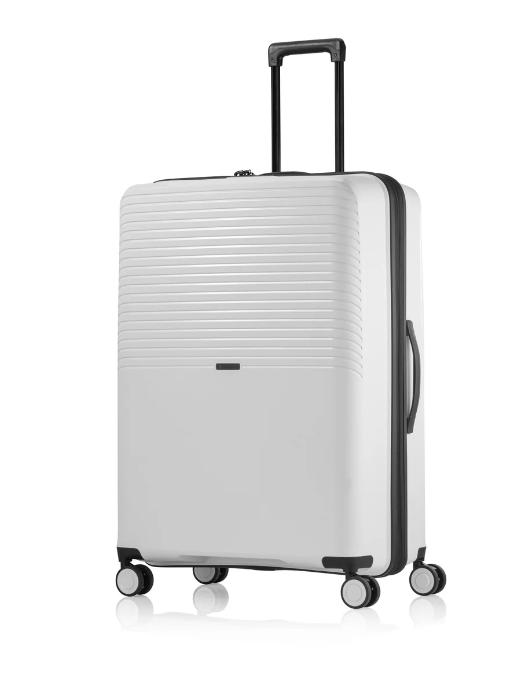
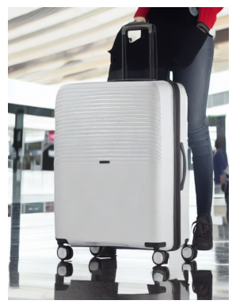

# Inpainting
In this repo we develop an AI solution that generates stunning product photoshoot visuals given an product raw image, using Inpainting we are able to generate realistic background with the product.

## Flow of the Image


## Description
In the process of inpainting, achieving an accurate mask of the object to be inpainted is crucial. To obtain such a precise mask, we utilize a combination of the Segment Anything Model (SAM) and a pretrained zero-shot object detector. The reason for choosing a zero-shot object detector is the absence of a pretrained object detector that encompasses all the required classes. By leveraging the capabilities of a zero-shot object detector, we are able to generate precise masks for a diverse range of objects, thereby enhancing the quality of the inpainting results.

Detailed Explanation

- Role of Masks:

  A mask defines the area of the image that needs to be inpainted.
  The accuracy of the mask directly impacts the quality of the inpainting, as it guides the algorithm to only modify the necessary parts of the image while preserving the rest.

- Segment Anything Model (SAM):

  SAM is a model designed to generate masks for various objects within an image.
  It uses advanced segmentation techniques to identify and delineate objects.

- Zero-Shot Object Detector:

  A zero-shot object detector is capable of recognizing and detecting objects that it has not been explicitly trained on.
  This capability is particularly useful when dealing with a wide variety of objects that may not all be covered by traditional, pretrained object detectors.
  
- Combining SAM and Zero-Shot Object Detector:

  By integrating SAM with a zero-shot object detector, we enhance our ability to generate precise masks for a wide range of objects.
  SAM provides the initial segmentation, while the zero-shot object detector ensures that even uncommon or untrained objects are accurately identified and masked.
  Advantages:

## Installation Required for SAM (Segment Anything Model)

```bash
  pip install git+https://github.com/facebookresearch/segment-anything.git
```
### Download Weights SAM
```
  !wget -q https://dl.fbaipublicfiles.com/segment_anything/sam_vit_h_4b8939.pth
```

## Example of Generations

| Input Image | Inpainted Image |
|:-----------:|:---------------:|
|  | |

| Input Image | Inpainted Image |
|:-----------:|:---------------:|
|  | |

## Future Scope
- Using deeper and advanced models we can generate better quality images.
- Using these image we can generate videos for further helping our product AD.
  Example:
  https://github.com/naharnimish/Inpainting/assets/70885727/a37cb3f9-5cde-45a1-bcbd-6a37c1e14ede
  
